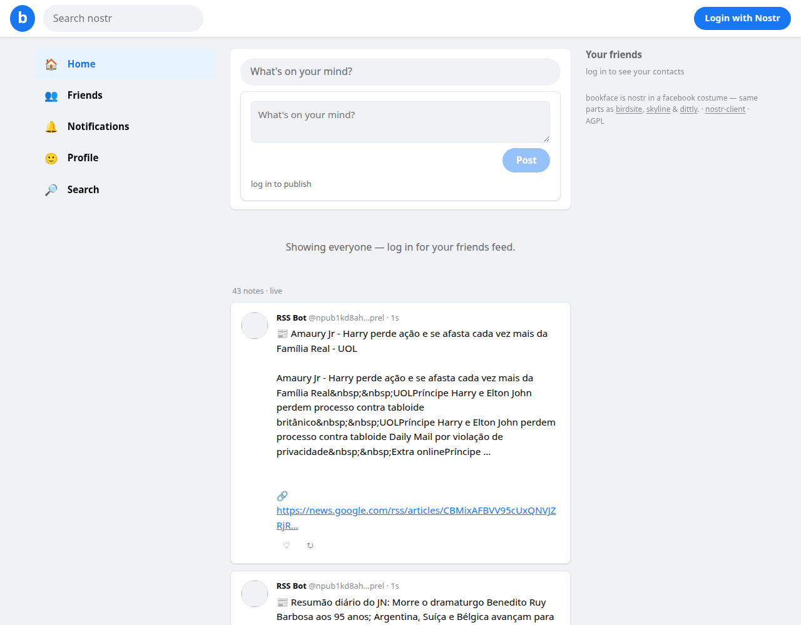

# bookface

A **facebook-flavored** nostr client: top navbar with search, left menu, card feed with “What’s on your mind?”, friends in the right column. One buildless HTML file.

**Live:** https://nostr-client.github.io/bookface/

Part of the [nostr-client](https://nostr-client.github.io/) **replica gallery** —
every replica is CSS tokens + layout over the exact same components that power
[zen](https://nostr-client.github.io/zen/), [micro](https://nostr-client.github.io/micro/),
[monty](https://nostr-client.github.io/monty/) and
[skyline](https://nostr-client.github.io/skyline/). Verified events, cached pool,
threads, profiles, hashtags — all standard. This file only adds the facebook card feed.

AGPL-3.0-or-later.
